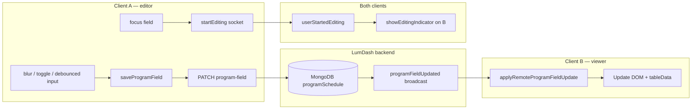

# Schedule Page Porting Guide

Instructions for bringing LumDash schedule updates into another app that uses the same backend and schedule data. Start with **row color coding** (Red, Blue, Green, Yellow), then wire up the **realtime collaboration** model.

**Reference implementation (LumDash `main`, commit `174d0ec`):**

| Layer | Primary files |
|-------|----------------|
| Client schedule UI | `js/schedule.js`, `css/schedule.css` |
| Presence / editing indicators | `js/schedule-simple-collab.js` |
| Navigation / event id | `js/app.js`, `dashboard.html` |
| API + sockets | `backend/server.js`, `backend/models/Table.js` |

---

## Prerequisites

- Your app talks to the same LumDash API (`/api/tables/:id`, Socket.IO on the same origin).
- Schedule rows are stored in `Table.programSchedule[]` (Mongo subdocuments with `_id`).
- You have a global Socket.IO client (`window.socket`) and JWT auth in `localStorage.token`.
- Confirm which copy of schedule code your app actually serves (LumDash serves from repo root `js/`, not `frontend/`).

---

## Part 1 — Row Color Coding

Right-click (desktop) or long-press (mobile) a schedule row to open a color menu: **Red**, **Blue**, **Green**, **Yellow**, or **Clear color**.

### 1.1 Database schema

Add `rowColor` to each program subdocument (and concurrency metadata if you are also porting collab hardening):

```js
// backend/models/Table.js — programSchema
rowColor: { type: String, default: '' }, // '', 'red', 'blue', 'green', 'yellow'
important: { type: Boolean, default: false }, // legacy; old data may still use this
lastModified: Date,
lastModifiedBy: { type: mongoose.Schema.Types.ObjectId, ref: 'User' },
rev: { type: Number, default: 0 }
```

New programs created via `POST /api/tables/:id/program` should default `rowColor: ''`.

No separate API endpoint is required — color uses the same field-level PATCH as every other program field (see Part 2).

**Legacy:** rows with `important: true` and no `rowColor` still render as red via `getProgramRowColor()`.

### 1.2 Rendering — card view and table view

```js
const SCHEDULE_ROW_COLORS = { red: {}, blue: {}, green: {}, yellow: {} };

function getProgramRowColor(program) {
  if (program.rowColor && SCHEDULE_ROW_COLORS[program.rowColor]) return program.rowColor;
  if (program.important) return 'red';
  return '';
}

function getProgramRowColorClass(program) {
  const color = getProgramRowColor(program);
  return color ? ` schedule-color-${color}` : '';
}
```

**Card view** (`renderProgramSections`):

```js
entry.className = 'program-entry' +
  (program.done ? ' done-entry' : '') +
  getProgramRowColorClass(program);
```

**Table view** (`renderScheduleTable`):

```js
row.className = (program.done ? 'done-row' : '') + getProgramRowColorClass(program);
```

Both views must expose `data-program-index` on the row/card container — the menu resolves the index from that attribute.

### 1.3 CSS

Port from `css/schedule.css`:

| Class | Purpose |
|-------|---------|
| `.program-entry.schedule-color-red` … `.schedule-color-yellow` | Card tint per color |
| `.schedule-table-section tbody tr.schedule-color-*` | Table row tint + left accent bar |
| `.schedule-color-menu` | Right-click / long-press popup |
| `.schedule-color-swatch-*` | Color dots in the menu |
| `.schedule-color-toast` / `.show` | Bottom confirmation toast |
| `.schedule-longpress-pending` | Subtle feedback while waiting for long-press |

### 1.4 Set color logic

```js
function setProgramRowColor(programIndex, colorId) {
  const program = tableData.programs[programIndex];
  const oldValue = getProgramRowColor(program);
  const newValue = colorId && SCHEDULE_ROW_COLORS[colorId] ? colorId : '';
  applyProgramRowColorStyles(programIndex, newValue);   // optimistic UI
  showScheduleToast(newValue ? `Marked ${SCHEDULE_ROW_COLORS[newValue].label}` : 'Color cleared');
  saveProgramField({ programIndex, field: 'rowColor', value: newValue, oldValue, baseValue: oldValue });
}
```

Route through `saveProgramField`, not a direct fetch or socket emit.

### 1.5 Color menu + gestures

Call `setupScheduleColorGestures()` once after the schedule page finishes its first render.

| Platform | Gesture | Behavior |
|----------|---------|----------|
| Desktop (>768px) | Right-click on row/card | Open `#scheduleColorMenu` at cursor |
| Mobile (≤768px) | Long-press 500ms | Open menu at touch point |

Skip gestures on interactive targets:

```js
target.closest('input, textarea, select, button, a, label, .delete-date-btn, .delete-row-btn')
```

Menu options: Red, Blue, Green, Yellow, Clear color. Click outside closes the menu.

### 1.6 Remote sync

In `applyRemoteProgramFieldUpdate(data)`:

```js
if (field === 'rowColor' || field === 'important') {
  const colorId = field === 'rowColor' ? (value || '') : (value ? 'red' : '');
  applyProgramRowColorStyles(programIndex, colorId);
}
safeUpdateProgram(programIndex, field, value);
```

### 1.7 Checklist — Row Color Coding

- [ ] `rowColor` on program schema + default on new rows
- [ ] Card/table render applies `schedule-color-*` classes
- [ ] CSS + context menu ported
- [ ] `setProgramRowColor` → `saveProgramField({ field: 'rowColor' })`
- [ ] Desktop right-click + mobile long-press open color menu
- [ ] Remote handler updates classes when another user changes color
- [ ] Manual test: pick colors in two browsers; refresh confirms persistence

---

## Part 2 — Realtime Collaboration Workflow

### 2.1 Design principle (read this first)

**There is exactly one save + broadcast pipeline for field values:**

```
User edit  →  saveProgramField()  →  PATCH /api/tables/:id/program-field
                                              ↓
                                    server writes MongoDB
                                              ↓
                                    io.emit('programFieldUpdated')
                                              ↓
                              applyRemoteProgramFieldUpdate()  (other clients)
```

**Do not** save field values through Socket.IO `updateField`. That path is deprecated and ignored on the server. Sockets are for:

1. **Broadcasting** authoritative changes after the REST PATCH succeeds
2. **Presence** — “User X is editing field Y” indicators
3. **Structural ops** — add/delete row, delete date (separate REST endpoints + socket events)

`schedule-simple-collab.js` handles presence only. `schedule.js` handles all data persistence and applying remote field updates.



### 2.2 Initialization sequence

When the schedule page loads (`loadPrograms` / `initPage`):

1. Fetch event via `GET /api/tables/:eventId`
2. Render programs (`renderProgramSections`)
3. Register socket listeners in `schedule.js` (field + structural events)
4. Load `schedule-simple-collab.js` dynamically if not present
5. Call `SimpleCollab.init(eventId, userId, userName)` **once** (`window.__simpleCollabInitialized` guard)

### 2.3 Socket room membership (critical)

Clients must join `event-{eventId}` on **every** `connect` / reconnect — not only if the socket is already connected at init time:

```js
const joinRooms = () => {
  window.socket.emit('joinEventRoom', { eventId, userId, userName, userColor });
  window.socket.emit('joinScheduleCollaboration', { eventId, userId, userName, userColor });
};
window.socket.on('connect', joinRooms);
if (window.socket.connected) joinRooms();
```

If you skip the reconnect handler, cloud/mobile clients often miss all live updates until a manual refresh.

### 2.4 Saving a field — client side

#### `saveProgramField({ programIndex, field, value, element, oldValue, baseValue })`

Central funnel for every field change: text inputs, checkboxes (`done`), row color, table inline edits.

Steps inside `saveProgramField`:

1. Update in-memory `tableData.programs[programIndex][field]`
2. Register a 10s “recently edited” guard (`recentlyEditedFields`) so your own socket echo is ignored
3. If row has no `_id` yet → fall back to full schedule save
4. Call `atomicSaveField()` → `PATCH /api/tables/:id/program-field`

#### `atomicSaveField(field, fieldKey, programId, newValue, baseValue)`

```http
PATCH /api/tables/:eventId/program-field
Authorization: Bearer <token>
Content-Type: application/json

{
  "programId": "<mongo subdoc _id>",
  "field": "location",
  "value": "Main Hall",
  "userId": "<user id>",
  "sessionId": "<per-tab session id from SimpleCollab>",
  "baseValue": "Lobby"          // omit for debounced keystroke saves (last-write-wins)
}
```

Response handling:

| Status | Action |
|--------|--------|
| `200` | Success — server already broadcast `programFieldUpdated` |
| `409` | Conflict — call `handleFieldConflict()` → apply server value via `applyRemoteProgramFieldUpdate` |
| Other | Show error UI, queue retry if available |

#### Text field editing — two save triggers

| Trigger | When | `baseValue` |
|---------|------|-------------|
| Debounced input (~900ms) | While typing | omitted (LWW) |
| Blur (`autoSave`) | Field loses focus | `field.dataset.focusValue` from `enableEdit` |

**Regression to avoid:** `optimisticInputHandler` mutates `tableData` on every keystroke. `autoSave` must compare against `field.dataset.focusValue` captured in `enableEdit`, not against `tableData` — otherwise change detection always says “no change” and saves are silently skipped.

```js
function enableEdit(field) {
  field.dataset.focusValue = field.type === 'checkbox'
    ? String(field.checked)
    : (field.value ?? '');
  // ...
}
```

### 2.5 Server — PATCH handler

`backend/server.js` — `PATCH /api/tables/:id/program-field`:

1. **Auth:** admin, owner, lead, or `sharedWith` user
2. **Conflict check (409):** only when `baseValue` is sent, server value ≠ `baseValue`, server value ≠ new `value`, and `lastModifiedBy` is a *different* user
3. **Atomic update:** Mongo `$set` on `programSchedule.$.{field}`, `lastModified`, `lastModifiedBy`; `$inc rev`
4. **Broadcast:**

```js
io.to(`event-${tableId}`).emit('programFieldUpdated', {
  eventId, programId, field, value, oldValue, rev,
  userId, sessionId, userName, timestamp
});
```

Deprecated — log and ignore:

```js
socket.on('updateField', ...) // DO NOT USE for persistence
```

### 2.6 Applying remote updates — client side

`schedule.js` listens:

```js
window.socket.on('programFieldUpdated', (data) => {
  applyRemoteProgramFieldUpdate(data);
});
```

`applyRemoteProgramFieldUpdate(data)` filters before mutating:

| Filter | Reason |
|--------|--------|
| `data.eventId !== currentEventId` | Wrong event |
| `data.sessionId === SimpleCollab session` | Own echo |
| Field in `recentlyEditedFields` (<10s) | Own save in flight |
| Target field is actively focused / cell in `.editing` | Don't clobber local typing |

Then update card view inputs, table view cells, `schedule-color-*`/`done` classes, and `tableData` via `safeUpdateProgram`.

### 2.7 Presence — SimpleCollab only

`schedule-simple-collab.js`:

| Event | Direction | Purpose |
|-------|-----------|---------|
| `startEditing` | client → server | User focused a schedule field |
| `stopEditing` | client → server | User blurred a field |
| `userStartedEditing` | server → clients | Show colored border / “X is editing” |
| `userStoppedEditing` | server → clients | Remove indicator |

Attached via delegated `focusin` / `focusout` on schedule fields. **No field values are sent or saved here.**

Each browser tab gets a unique `sessionId` (`Date.now() + random`) so a user with two tabs does not filter out their own broadcasts incorrectly.

### 2.8 Structural changes (add / delete row or date)

Avoid full-array `PUT` of `programSchedule` while others are editing individual fields — it clobbers concurrent PATCHes.

Use dedicated REST endpoints; server broadcasts surgical socket events; `schedule.js` patches local `tableData` and re-renders:

| REST | Socket event | Client handler |
|------|--------------|----------------|
| `POST /api/tables/:id/program` | `programInserted` | push row + `renderProgramSections` |
| `DELETE /api/tables/:id/program/:programId` | `programRemoved` | splice + re-render |
| `DELETE /api/tables/:id/program-date/:date` | `programsRemovedByDate` | filter by date + re-render |

Include `sessionId` in request body so the originating tab ignores its own broadcast.

Permissions: structural ops require admin/owner/lead (`canEditSchedule`). Field PATCH also allows `sharedWith`.

### 2.9 Reconnect resync

On socket `connect` after the **first** connection, re-fetch the schedule:

```js
window.socket.on('connect', () => {
  if (!socketHasConnectedBefore) { socketHasConnectedBefore = true; return; }
  if (window.isActiveEditing) { window.pendingReload = true; return; }
  loadPrograms(currentEventId);
});
```

This heals missed broadcasts during disconnects. Skip if the user is mid-edit.

### 2.10 Event ID / navigation (if your other app is an SPA)

If your app keeps stale `?eventId=` query params while only updating the hash, refresh can load the wrong event. LumDash fixes:

- `syncSpaUrl(page)` — strip `?eventId=`, `?page=`, `?id=` on every navigate; keep `#page` hash only
- `resolveEventIdForPage(page)` — use `lastPageState` → `localStorage`, **not** URL query params
- Dashboard bootstrap uses query params only for one-shot gear-page deep links when hash is empty

Port these patterns if your secondary app embeds the same dashboard shell.

---

## Part 3 — API Quick Reference

### Field update

```
PATCH /api/tables/:eventId/program-field
Body: { programId, field, value, userId?, sessionId?, baseValue? }
→ 200 { field, value, oldValue, rev }
→ 409 { conflict: true, currentValue, ... }
→ 403 if user lacks access
```

Valid `field` values match program schema keys: `name`, `startTime`, `endTime`, `location`, `photographer`, `folder`, `notes`, `done`, `rowColor`, etc.

### Socket events — field sync

| Event | Payload highlights |
|-------|-------------------|
| `programFieldUpdated` | `eventId`, `programId`, `field`, `value`, `sessionId`, `userName` |

### Socket events — presence

| Event | Payload highlights |
|-------|-------------------|
| `startEditing` / `stopEditing` | `eventId`, `programId`, `field`, `sessionId`, `userName`, `color` |
| `userStartedEditing` / `userStoppedEditing` | same |

### Socket events — structure

| Event | Payload highlights |
|-------|-------------------|
| `programInserted` | `eventId`, `program`, `sessionId` |
| `programRemoved` | `eventId`, `programId`, `sessionId` |
| `programsRemovedByDate` | `eventId`, `date`, `sessionId` |

---

## Part 4 — Porting order (recommended)

1. **Schema** — `rowColor`, `lastModified`, `lastModifiedBy`, `rev` on programs
2. **Server** — ensure `PATCH /program-field` exists, deprecate socket `updateField`
3. **Client save pipeline** — `saveProgramField` → `atomicSaveField` → handle 409
4. **Client remote apply** — `applyRemoteProgramFieldUpdate` + `programFieldUpdated` listener
5. **Row color coding** — menu UI, CSS, gestures, remote class sync
6. **SimpleCollab** — presence only; room join on connect/reconnect
7. **Structural endpoints** — replace full-array saves for add/delete
8. **Reconnect resync** — `loadPrograms` on socket reconnect
9. **Navigation fix** — if applicable to your app shell

---

## Part 5 — Test plan

### Row color coding

- [ ] Long-press on mobile opens color menu
- [ ] Right-click on desktop opens color menu
- [ ] All four colors + clear work in card and table views
- [ ] Row/card styling persists after refresh
- [ ] Other browser sees color update within ~1s without refresh

### Field collaboration

- [ ] User A edits location; User B sees update when A blurs (or after debounce)
- [ ] Both users editing **different** fields on the same row — both saves stick
- [ ] Editing indicators show correct user color on the field being edited
- [ ] User A does not receive a duplicate overwrite from their own save (`sessionId` filter)

### Conflict / edge cases

- [ ] Simulate 409 (two users edit same field from same baseline) — losing client adopts server value
- [ ] Disconnect Wi‑Fi 10s, reconnect — schedule resyncs
- [ ] Open two events in sequence — second event’s data does not bleed into first (event id + room join)
- [ ] Refresh on schedule page loads correct event (no stale query param override)

### Structural

- [ ] User A adds row; User B sees new row without full page reload
- [ ] User A deletes row/date; User B’s view updates

---

## Part 6 — Common mistakes

| Mistake | Symptom | Fix |
|---------|---------|-----|
| Saving via socket `updateField` | Edits show locally, never persist | Use PATCH only |
| No room rejoin on reconnect | Updates stop until refresh | `socket.on('connect', joinRooms)` |
| `autoSave` compares to `tableData` after optimistic input | Location/notes silently don’t save | Compare to `dataset.focusValue` |
| Full `PUT` of entire `programSchedule` | Random field loss under concurrent edits | PATCH fields + structural endpoints |
| Reading `?eventId=` on refresh | Wrong event after navigating between events | `syncSpaUrl` + `resolveEventIdForPage` |
| SimpleCollab saves on `input` | Double-save races, OT complexity | Presence only in SimpleCollab |

---

## Questions / handoff

When porting to the other app, confirm:

1. Does it load `js/schedule.js` from LumDash directly, or a forked copy?
2. Does it share the same Socket.IO server and `joinEventRoom` handler?
3. Is schedule embedded in an iframe (may need separate room join + event id wiring)?

For line-by-line reference, diff against LumDash commit **`174d0ec`** on `main`.
